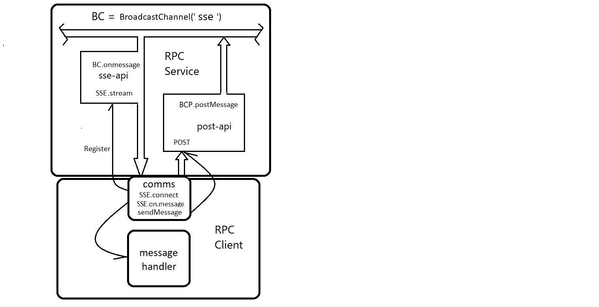

# Async RPC over SSE
Asynchronous Remote Procedure Calls, implemented with Server Sent Events.
   
This service architecture is as follows:    



## SSE
Server Sent Events is a client/server service.   

The server listens for registration events from clients.    
When a client registers, the server sets up a unidirectional stream connection to that client.   

The client side code works almost identically to websockets. A client registers for a connection using an `EventSource`, then handles new messages from the streaming service.       
  
## RPC
Remote Procedure Calls: A framework to call procedures (methods or commands) on a remote service.   

Our service uses a simplified JSON-RPC model See: `protocol` below.     

RPC allows clients to call procedures/methods as if they where local. This implementaion supports asynchronous method calls. That is, calls to a remote service that return an immediate promise to be resoved after the service returns a result or error. These non-blocking calls help support highly performant UI applications Like DWM-GUI apps.   
       
### Difference between RPC and REST  
RPC was designed for actions, while REST is resource-centric. 
 - RPC: returns the result of the execution of procedures or commands 
 - REST: supports domain modeling and the handling of large quantities of data  

## The RPC service
  * This service has a few built-in Remote Procedures that a client may call with the correct protocol.   
  See the rpc-list below.
  * A client-side rpc-call uses an async registry that returns a promise. When the server eventually responds to the call(sse-onmessage), the client-rpc resolves the promise with a result or an error. 

## Protocol
An RPC call to the server must use the following protocol:
```js
type RpcId = number;
type RpcProcedure = "getFileList" | "getFile" | "saveFile" ;
type RpcParams = JsonArray | JsonObject;

interface RpcRequest {
    msgID: RpcId;
    procedure: RpcProcedure;
    params?: RpcParams;
}

interface RpcResponse {
    msgID: RpcId;
    error: JsonValue;
    result: JsonValue;
}

type JsonPrimitive = string | number | boolean | null;
type JsonObject = { [member: string]: JsonValue };
type JsonArray = JsonValue[];
type JsonValue = JsonPrimitive | JsonObject | JsonArray;
```

This service can be called `raw`; without the clients async support. 
    
A `raw` client call is performed as:

```js
   fetch("/rpc", {
      method: "POST",
      body: JSON.stringify({ msgID: msgID, procedure: procedure, params: params }),
   });
```
The server will perform the procedure and return either a result or an error response to the EventSource.onMessage handler.      
See: `interface RpcResponse` above.   

The client, on receipt of the sse-message, will unpack the response, locate the stored promise registered to this `msgID`, and either resolve or reject it depending on the values of error and result.    
See: `/example/arpcClient.js`    
 


## Built-in Remote Procedures
The following are the current built-in procedures.    

 1. `getFileList` - returns the results of a `deno-walk`. // params{ root, folder }
 2. `getFile` - returns the text content of a file.       // params{ folder, name }
 3. `saveFile` - saves text content to a file.            // params{ folder, name, content }
 
You can see these in action in the example application in the included /example folder.   
(Open the `/example/readme.md` for instructions)
